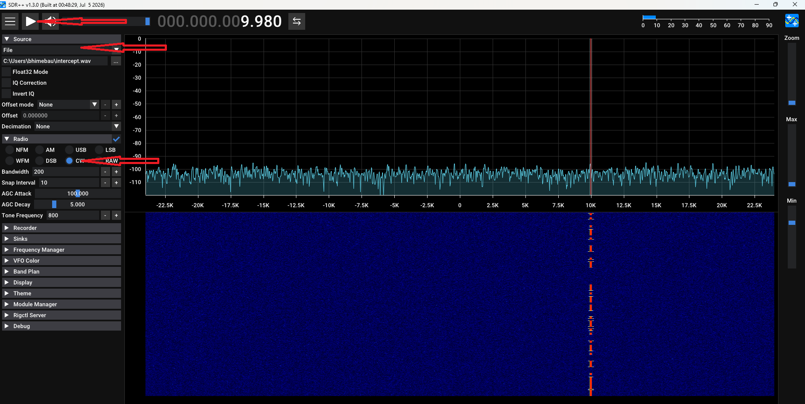

# Intercepted Transmission

A repeating radio transmission has been captured.

## Your objective

Use **SDR++** to investigate the captured signal and determine the message being transmitted.

### Getting started

1. Download [`files/intercept.wav`](https://github.com/Satellite-Data/intercept/raw/refs/heads/main/files/intercept.wav).
2. Launch **SDR++** on one of the Linux computers using the command **sdrpp** in a terminal window.
3. Select **File Source** and open `intercept.wav`.
4. Start the file and examine the spectrum and waterfall.
5. Find the transmission, tune to it, and determine what it says.

> **Important:** The frequency numbers are not part of this puzzle.  
> **Follow the signal, not the numbers.**

### Need help decoding?

A reference sheet is available here:

**[International Morse Code Reference](files/morse-reference.pdf)**

Record the decoded message and give it to your event facilitator.

### SDR++ Screenshot 

